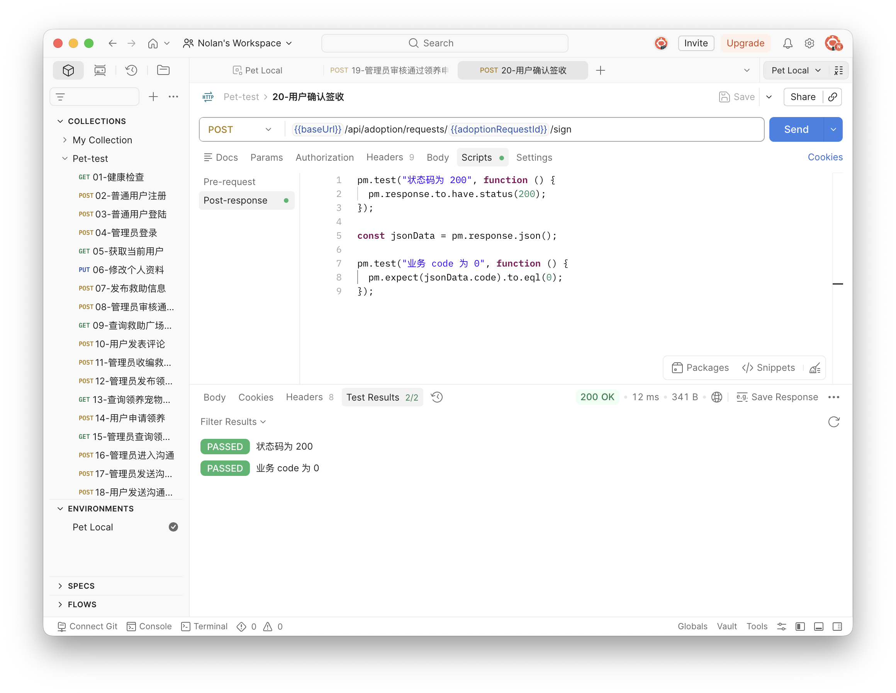
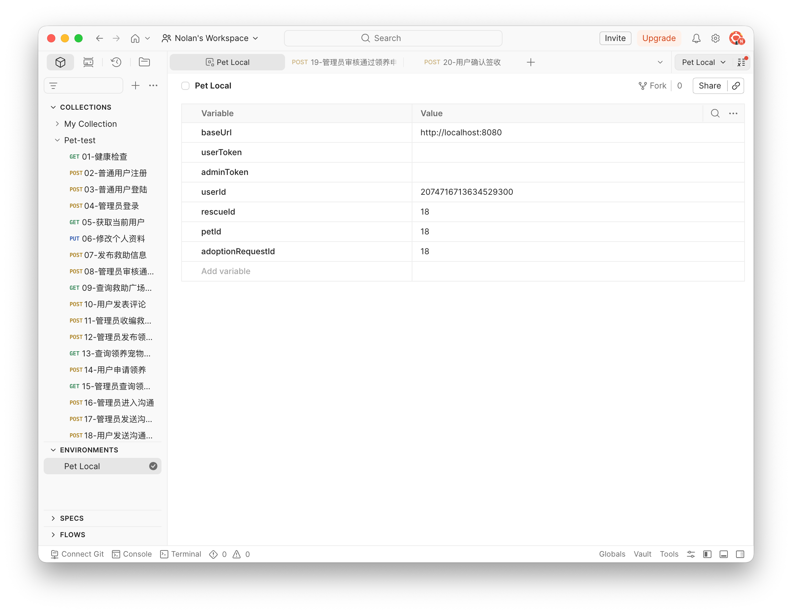

# 接口测试执行报告

## 执行准备

| 项目 | 内容 |
| --- | --- |
| 执行日期 | 2026-07-08 |
| 执行环境 | 本地 Spring Boot + MySQL |
| 后端地址 | `http://localhost:8080` |
| 测试工具 | Postman |
| Collection | `Pet-test.postman_collection.json` |
| 测试图片 | 本地测试图片 |
| 管理员账号 | 本地测试管理员账号 |

## 环境变量

| 变量名 | 初始值 | 说明 |
| --- | --- | --- |
| `baseUrl` | `http://localhost:8080` | 后端服务地址 |
| `userToken` | 空 | 普通用户登录后自动保存 |
| `adminToken` | 空 | 管理员登录后自动保存 |
| `userId` | 空 | 普通用户登录后自动保存 |
| `rescueId` | 空 | 发布救助后自动保存 |
| `petId` | 空 | 管理员发布宠物后自动保存 |
| `adoptionRequestId` | 空 | 用户申请领养或管理员查询后保存 |

## 核心主流程执行结果

本轮 Postman Collection 实际执行 20 条请求，其中 18 条对应核心接口用例；第 15 条请求用于保存 `adoptionRequestId`，第 17/18 条分别验证管理员和普通用户都可以调用沟通消息接口。

| 序号 | 用例编号 | 接口/操作 | 请求方式 | URL | 预期结果 | 实际结果 | 是否通过 |
| --- | --- | --- | --- | --- | --- | --- | --- |
| 1 | API_HEALTH_001 | 健康检查 | GET | `/api/health` | HTTP 200，`code=0` | 返回 HTTP 200，业务 `code=0` | 通过 |
| 2 | API_AUTH_001 | 普通用户注册 | POST | `/api/auth/register` | 注册成功，`code=0` | 返回 HTTP 200，业务 `code=0` | 通过 |
| 3 | API_AUTH_002 | 普通用户登录 | POST | `/api/auth/login` | 返回 `userToken` 和用户信息 | 返回 HTTP 200，业务 `code=0`，已保存 `userToken` 和 `userId` | 通过 |
| 4 | API_AUTH_003 | 管理员登录 | POST | `/api/auth/login` | 返回 `adminToken`，角色为管理员 | 返回 HTTP 200，业务 `code=0`，已保存 `adminToken` | 通过 |
| 5 | API_AUTH_004 | 获取当前用户 | GET | `/api/auth/me` | 返回当前用户信息 | 返回 HTTP 200，业务 `code=0` | 通过 |
| 6 | API_USER_001 | 修改个人资料 | PUT | `/api/users/profile` | 修改成功 | 返回 HTTP 200，业务 `code=0` | 通过 |
| 7 | API_RESCUE_001 | 发布救助信息 | POST | `/api/rescues` | 发布成功，保存 `rescueId` | 返回 HTTP 200，业务 `code=0`，已保存 `rescueId` | 通过 |
| 8 | API_ADMIN_RESCUE_001 | 审核通过救助 | POST | `/api/admin/rescues/{id}/approve` | 审核成功 | 返回 HTTP 200，业务 `code=0` | 通过 |
| 9 | API_RESCUE_002 | 查询救助广场列表 | GET | `/api/rescues` | 列表包含已审核救助 | 返回 HTTP 200，业务 `code=0` | 通过 |
| 10 | API_COMMENT_001 | 发布评论 | POST | `/api/rescues/{id}/comments` | 评论成功 | 返回 HTTP 200，业务 `code=0` | 通过 |
| 11 | API_ADMIN_RESCUE_002 | 管理员收编 | POST | `/api/admin/rescues/{id}/adopt` | 状态变为已收编 | 返回 HTTP 200，业务 `code=0` | 通过 |
| 12 | API_ADMIN_PET_001 | 发布领养宠物 | POST | `/api/admin/adoption/pets` | 发布成功，保存 `petId` | 返回 HTTP 200，业务 `code=0`，已保存 `petId` | 通过 |
| 13 | API_ADOPTION_001 | 查询宠物列表 | GET | `/api/adoption/pets` | 列表包含公示中宠物 | 返回 HTTP 200，业务 `code=0` | 通过 |
| 14 | API_ADOPTION_002 | 申请领养 | POST | `/api/adoption/requests` | 创建申请 | 返回 HTTP 200，业务 `code=0` | 通过 |
| 15 | 辅助请求 | 管理员查询领养申请 | GET | `/api/admin/adoption/requests` | 查询申请并保存 ID | 返回 HTTP 200，已保存 `adoptionRequestId` | 通过 |
| 16 | API_ADMIN_ADOPTION_001 | 管理员进入沟通 | POST | `/api/admin/adoption/requests/{id}/start` | 状态变为沟通中 | 返回 HTTP 200，业务 `code=0` | 通过 |
| 17 | API_COMM_001 | 管理员发送沟通消息 | POST | `/api/adoption/requests/{id}/messages` | 发送成功 | 返回 HTTP 200，业务 `code=0` | 通过 |
| 18 | API_COMM_001 | 用户发送沟通消息 | POST | `/api/adoption/requests/{id}/messages` | 发送成功 | 返回 HTTP 200，业务 `code=0` | 通过 |
| 19 | API_ADMIN_ADOPTION_002 | 审核通过领养申请 | POST | `/api/admin/adoption/requests/{id}/approve` | 进入待签收/运输中 | 返回 HTTP 200，业务 `code=0` | 通过 |
| 20 | API_ADOPTION_003 | 用户确认签收 | POST | `/api/adoption/requests/{id}/sign` | 签收成功，流程闭环 | 返回 HTTP 200，业务 `code=0`，Postman 断言 2/2 通过 | 通过 |

## 汇总结论

| 项目 | 数量 |
| --- | ---: |
| Postman 实际执行请求数 | 20 |
| 核心接口用例数 | 18 |
| 通过数 | 18 |
| 失败数 | 0 |
| 阻塞数 | 0 |

本次接口测试覆盖健康检查、普通用户注册登录、管理员登录、当前用户查询、个人资料修改、救助发布、管理员审核通过、救助列表查询、评论发布、管理员收编、管理员发布领养宠物、领养宠物列表查询、用户申请领养、管理员进入沟通、沟通消息、管理员审核通过和用户确认签收。核心接口主流程返回 HTTP 200 且业务 `code=0`，Postman 断言通过。

## 截图证据

