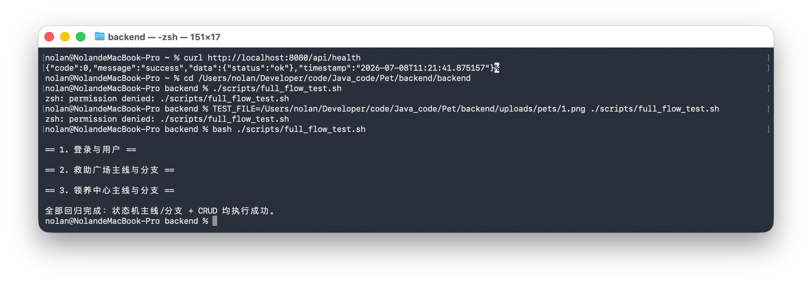

# full_flow_test.sh 回归脚本说明

## 脚本位置

```text
<backend-project>/backend/backend/scripts/full_flow_test.sh
```

## 脚本定位

该脚本基于 Shell + curl 实现接口自动化回归测试，覆盖宠物救助与领养平台的核心业务流程和关键状态流转。

## 覆盖范围

| 模块 | 覆盖内容 |
| --- | --- |
| 登录与用户 | 注册普通用户、普通用户登录、管理员登录、获取当前用户、修改资料 |
| 救助广场主线 | 发布救助、管理员审核通过、查询列表、发表评论、删除评论、管理员收编、用户删除 |
| 救助广场分支 | 发布救助、管理员驳回、用户删除 |
| 领养中心主线 | 管理员发布宠物、修改宠物、用户申请领养、管理员进入沟通、双方发送消息、管理员审核通过、用户签收、删除记录 |
| 领养中心分支 | 管理员发布宠物、用户申请、进入沟通、管理员驳回、用户删除 |

## 执行前提

1. MySQL 服务已启动。
2. 后端服务已启动，默认地址为 `http://localhost:8080`。
3. 测试图片存在。
4. 管理员初始化账号可登录。

## 执行命令

```bash
cd <backend-project>/backend/backend
bash ./scripts/full_flow_test.sh
```

如果需要指定后端地址：

```bash
BASE_URL=http://localhost:8080 bash ./scripts/full_flow_test.sh
```

## 通过标准

终端输出：

```text
全部回归完成：状态机主线/分支 + CRUD 均执行成功。
```

且脚本执行过程中没有出现接口失败响应。

## 执行结果记录

| 项目 | 内容 |
| --- | --- |
| 执行日期 | 2026-07-08 |
| 执行环境 | 本地 Spring Boot + MySQL |
| 后端地址 | `http://localhost:8080` |
| 执行命令 | `bash ./scripts/full_flow_test.sh` |
| 执行结果 | 通过 |

终端输出：

```text
== 1. 登录与用户 ==

== 2. 救助广场主线与分支 ==

== 3. 领养中心主线与分支 ==

全部回归完成：状态机主线/分支 + CRUD 均执行成功。
```

执行截图：



验证结论：接口自动化回归脚本执行通过，覆盖登录与用户、救助广场主线与驳回分支、领养中心主线与驳回分支，核心状态机流转和基础 CRUD 接口验证成功。
