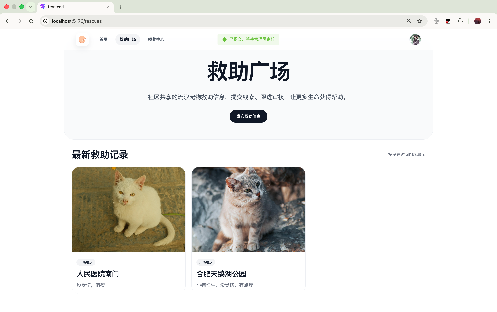
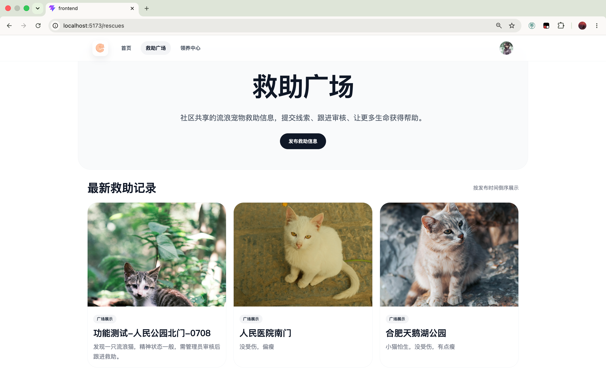
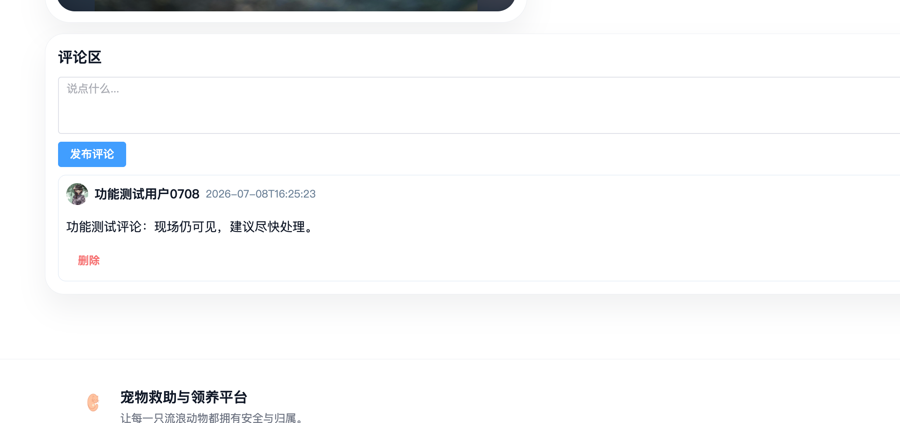
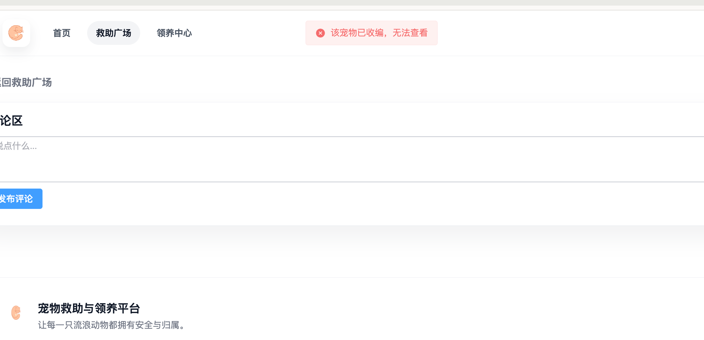
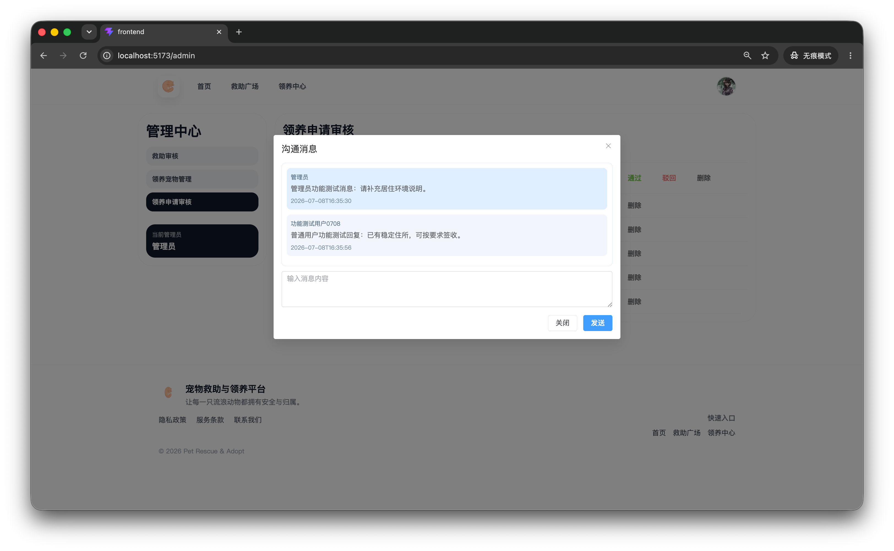
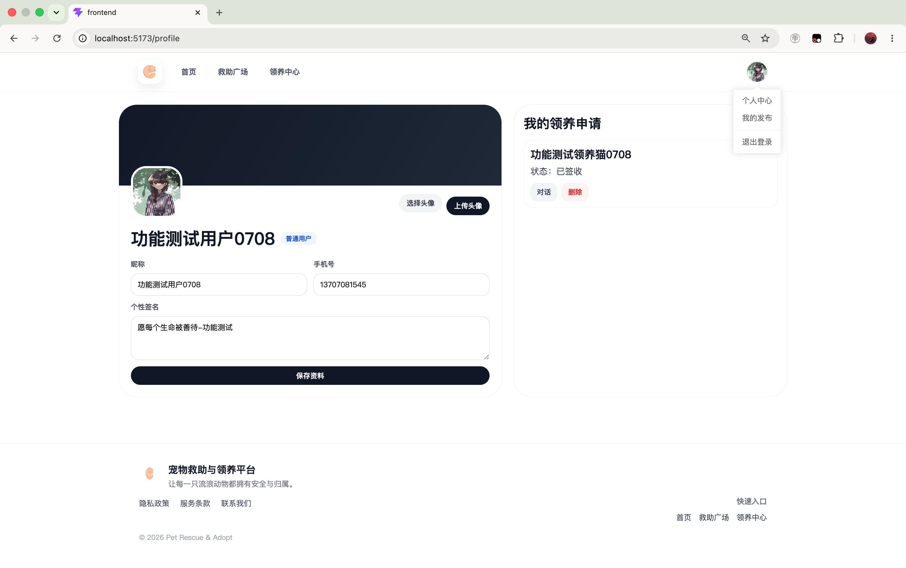

# 功能测试执行报告

## 文件说明

本文件记录功能测试实际执行结果，包含测试环境、测试数据、用例执行结果、截图附件和问题记录。截图统一保存到当前目录：

```text
screenshots/
```

## 测试环境

| 项目 | 内容 |
| --- | --- |
| 被测系统 | 流浪动物救助与领养平台 |
| 前端地址 | `http://localhost:5173` |
| 后端地址 | `http://localhost:8080` |
| 执行日期 | 2026-07-08 |
| 执行人员 | 测试执行人员 |
| 普通用户账号 | `func_user_0708_1545` |
| 管理员账号 | `admin` |

## 测试数据

| 数据类型 | 实际使用值 |
| --- | --- |
| 普通用户名 | `func_user_0708_1545` |
| 普通用户手机号 | `13707081545` |
| 普通用户密码 | 已脱敏 |
| 救助主流程位置 | 功能测试-人民公园北门-0708 |
| 救助驳回分支位置 | 功能测试-驳回分支-0708 |
| 领养宠物名称 | 功能测试领养猫0708 |

## 执行汇总

| 项目 | 数量 |
| --- | ---: |
| 功能用例数 | 17 |
| 通过数 | 17 |
| 失败数 | 0 |
| 阻塞数 | 0 |

## 注册登录与个人中心

| 用例编号 | 角色 | 测试点 | 结果 | 证据 |
| --- | --- | --- | --- | --- |
| FUNC_AUTH_001 | 普通用户 | 注册成功 | 通过，提示请登录 | `screenshots/01.png` |
| FUNC_AUTH_002 | 普通用户 | 登录成功 | 通过，进入系统页面 | - |
| FUNC_AUTH_003 | 管理员 | 登录成功 | 通过，可进入管理中心 | - |
| FUNC_PROFILE_001 | 普通用户 | 修改昵称和签名 | 通过，刷新后内容仍存在 | - |

## 救助流程

| 用例编号 | 角色 | 测试点 | 结果 | 证据 |
| --- | --- | --- | --- | --- |
| FUNC_RESCUE_001 | 普通用户 | 发布救助信息 | 通过，等待管理员审核 | `screenshots/02.png` |
| FUNC_RESCUE_002 | 管理员 | 审核通过救助 | 通过，救助广场可见 | `screenshots/03.png` |
| FUNC_RESCUE_003 | 普通用户 | 查看并评论救助详情 | 通过，评论正常显示 | `screenshots/04.png` |
| FUNC_RESCUE_004 | 管理员 | 收编救助信息 | 通过，用户无法继续查看详情 | `screenshots/05.png` |
| FUNC_RESCUE_005 | 管理员 | 驳回救助信息 | 通过，记录显示审核驳回 | - |

## 领养流程

| 用例编号 | 角色 | 测试点 | 结果 | 证据 |
| --- | --- | --- | --- | --- |
| FUNC_ADOPT_001 | 管理员 | 发布领养宠物 | 通过，用户可查看宠物 | - |
| FUNC_ADOPT_002 | 普通用户 | 申请领养 | 通过，个人中心显示申请 | `screenshots/06.png` |
| FUNC_ADOPT_003 | 管理员 | 进入沟通并发送消息 | 通过，消息正常显示 | `screenshots/07.png` |
| FUNC_ADOPT_004 | 普通用户 | 回复沟通消息 | 通过，消息正常显示 | `screenshots/07.png` |
| FUNC_ADOPT_005 | 管理员 | 审核通过领养申请 | 通过，状态变为运输中 | `screenshots/08.png` |
| FUNC_ADOPT_006 | 普通用户 | 确认签收 | 通过，状态变为已签收 | - |

## 权限控制

| 用例编号 | 角色 | 测试点 | 结果 | 证据 |
| --- | --- | --- | --- | --- |
| FUNC_AUTHZ_001 | 普通用户 | 不显示管理中心入口 | 通过，导航栏和头像菜单均不可见 | `screenshots/09.png` |
| FUNC_AUTHZ_002 | 未登录用户 | 不能发布救助或申请领养 | 通过，自动跳转登录页 | - |

## 缺陷结论

本轮功能测试未发现稳定可复现缺陷。缺陷与风险记录见 `../defect-and-risk.md`。

## 截图证据















