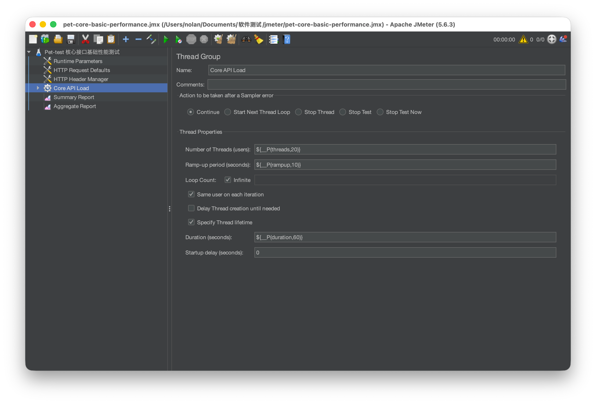
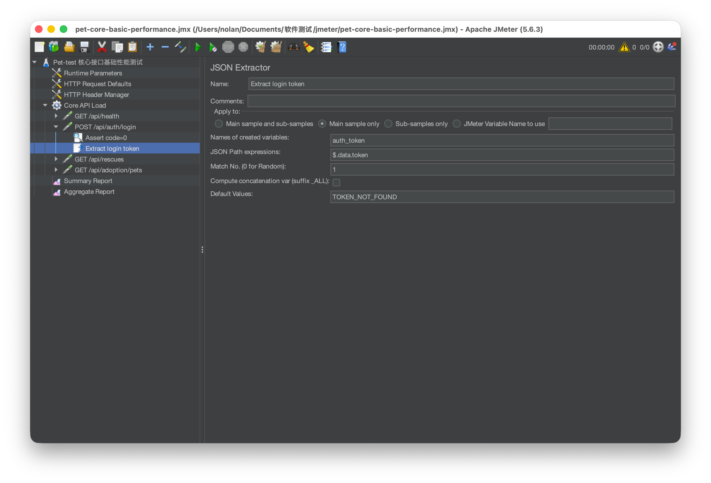
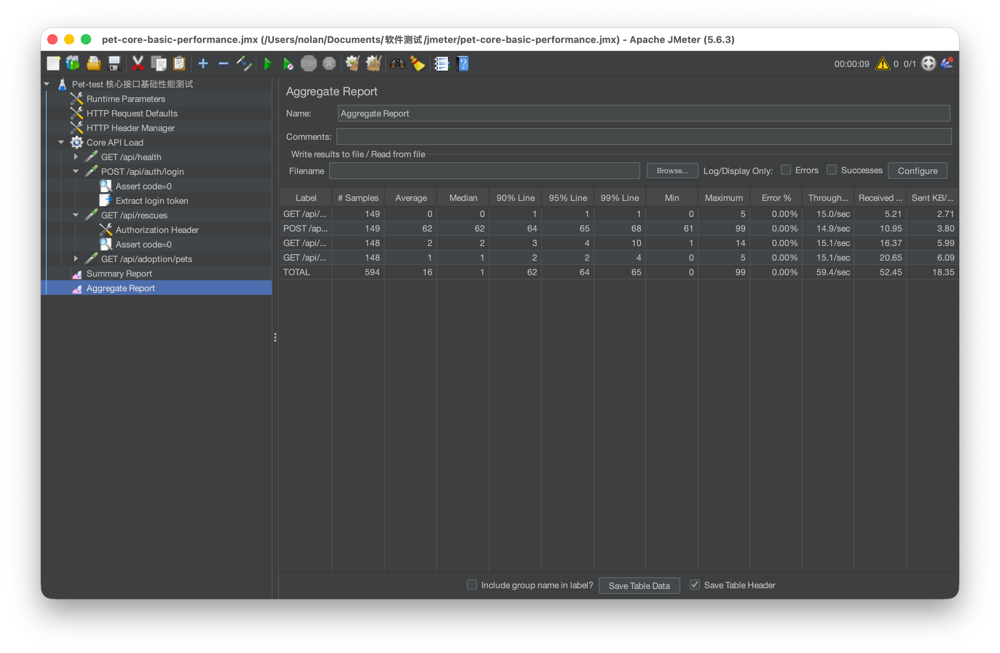

# 性能测试方案与执行报告

## 执行准备

| 项目 | 内容 |
| --- | --- |
| 执行日期 | 2026-07-09 |
| 执行环境 | 本地 Spring Boot + MySQL |
| 后端地址 | `http://localhost:8080` |
| 测试工具 | Apache JMeter 5.6.3 |
| 测试计划 | `pet-core-basic-performance.jmx` |
| 测试数据 | 本地测试账号，执行命令通过 JMeter 参数注入账号和密码，报告不记录明文密码 |

## 启动与检查

1. 启动后端：

```bash
cd <backend-project>/backend/backend
mvn spring-boot:run
```

2. 检查健康接口：

```bash
curl http://localhost:8080/api/health
```

预期返回包含：

```json
{"code":0,"message":"success","data":{"status":"ok"}}
```

3. 检查 JMeter：

```bash
jmeter --version
```

本轮使用版本：Apache JMeter 5.6.3。

## 测试范围

| 接口 | 方法 | 说明 |
| --- | --- | --- |
| `/api/health` | GET | 健康检查 |
| `/api/auth/login` | POST | 登录接口 |
| `/api/rescues` | GET | 救助广场列表 |
| `/api/adoption/pets` | GET | 领养中心列表 |

## 执行命令

执行前设置本地测试账号参数，不在报告中记录明文密码：

```bash
export PET_PERF_ACCOUNT="<本地测试账号>"
export PET_PERF_PASSWORD="<本地测试密码>"
```

20 并发场景：

```bash
jmeter -n -t performance-testing/pet-core-basic-performance.jmx \
  -Jthreads=20 -Jrampup=10 -Jduration=60 \
  -Jlogin_account="$PET_PERF_ACCOUNT" -Jlogin_password="$PET_PERF_PASSWORD" \
  -l performance-testing/output/pet-core-s1-20u.jtl \
  -e -o performance-testing/output/html-s1-20u
```

50 并发场景：

```bash
jmeter -n -t performance-testing/pet-core-basic-performance.jmx \
  -Jthreads=50 -Jrampup=20 -Jduration=120 \
  -Jlogin_account="$PET_PERF_ACCOUNT" -Jlogin_password="$PET_PERF_PASSWORD" \
  -l performance-testing/output/pet-core-s2-50u.jtl \
  -e -o performance-testing/output/html-s2-50u
```

100 并发场景：

```bash
jmeter -n -t performance-testing/pet-core-basic-performance.jmx \
  -Jthreads=100 -Jrampup=30 -Jduration=180 \
  -Jlogin_account="$PET_PERF_ACCOUNT" -Jlogin_password="$PET_PERF_PASSWORD" \
  -l performance-testing/output/pet-core-s3-100u.jtl \
  -e -o performance-testing/output/html-s3-100u
```

## 指标记录

### S1：20 并发，持续 60 秒

| 接口 | 样本数 | 平均/P95 ms | 吞吐量 req/s | 错误率 |
| --- | ---: | ---: | ---: | ---: |
| `GET /api/health` | 11381 | 0.4 / 1 | 189.77 | 0.00% |
| `POST /api/auth/login` | 11381 | 79.5 / 98 | 189.56 | 0.00% |
| `GET /api/rescues` | 11364 | 11.1 / 31 | 189.73 | 0.00% |
| `GET /api/adoption/pets` | 11362 | 6.0 / 20 | 189.72 | 0.00% |
| 合计 | 45488 | 24.3 / 86 | 757.48 | 0.00% |

### S2：50 并发，持续 120 秒

| 接口 | 样本数 | 平均/P95 ms | 吞吐量 req/s | 错误率 |
| --- | ---: | ---: | ---: | ---: |
| `GET /api/health` | 22899 | 0.6 / 3 | 190.88 | 0.00% |
| `POST /api/auth/login` | 22899 | 147.9 / 250 | 190.69 | 0.00% |
| `GET /api/rescues` | 22867 | 59.0 / 149 | 190.69 | 0.00% |
| `GET /api/adoption/pets` | 22856 | 33.3 / 100 | 190.62 | 0.00% |
| 合计 | 91521 | 60.2 / 196 | 762.03 | 0.00% |

### S3：100 并发，持续 180 秒

| 接口 | 样本数 | 平均/P95 ms | 吞吐量 req/s | 错误率 |
| --- | ---: | ---: | ---: | ---: |
| `GET /api/health` | 34281 | 1.2 / 7 | 190.48 | 0.00% |
| `POST /api/auth/login` | 34281 | 236.4 / 452 | 190.22 | 0.00% |
| `GET /api/rescues` | 34230 | 160.1 / 354 | 190.11 | 0.00% |
| `GET /api/adoption/pets` | 34194 | 84.7 / 227 | 189.98 | 0.00% |
| 合计 | 136986 | 120.6 / 354 | 760.07 | 0.00% |

## 公开交付物

| 文件 | 说明 |
| --- | --- |
| `pet-core-basic-performance.jmx` | JMeter 测试计划 |
| `screenshots/01-thread-group.png` | 线程组配置截图 |
| `screenshots/02-token-extractor.png` | 登录 Token 提取配置截图 |
| `screenshots/03-jmeter-aggregate-report.png` | JMeter 聚合报告截图 |

说明：JTL 原始结果和 JMeter HTML 报告为自动生成文件，体积较大，不纳入公开仓库。

## 测试证据

| 证据文件 | 说明 |
| --- | --- |
| `screenshots/01-thread-group.png` | JMeter 线程组配置，包含线程数、Ramp-Up、持续时间等基础并发参数 |
| `screenshots/02-token-extractor.png` | 登录接口 JSON Extractor 配置，从登录响应中提取 `$.data.token` 供后续接口鉴权使用 |
| `screenshots/03-jmeter-aggregate-report.png` | JMeter 聚合报告示例，展示接口样本数、平均响应时间、P90/P95、吞吐量和错误率 |







## 执行结论

本次性能测试在本地测试环境中对健康检查、登录、救助列表、领养宠物列表等核心接口进行了基础并发测试。三个场景均完成执行，整体错误率均为 0.00%。

随着并发数从 20 提升到 100，核心接口响应时间呈上升趋势。100 并发场景下，整体平均响应时间为 120.6 ms，P90 为 288 ms，P95 为 354 ms，整体吞吐量约 760.07 req/s。登录接口和救助列表接口相对更容易受到并发提升影响。

本次测试定位为本地开发环境基础并发测试，结果用于观察核心接口在小规模并发下的响应趋势，不作为生产容量评估结论。
